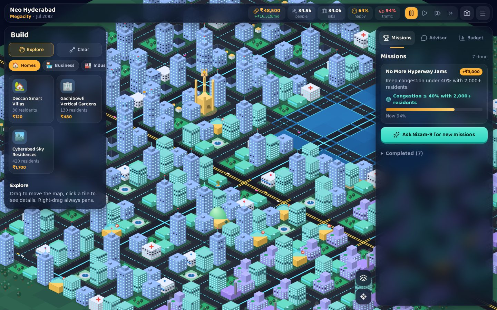
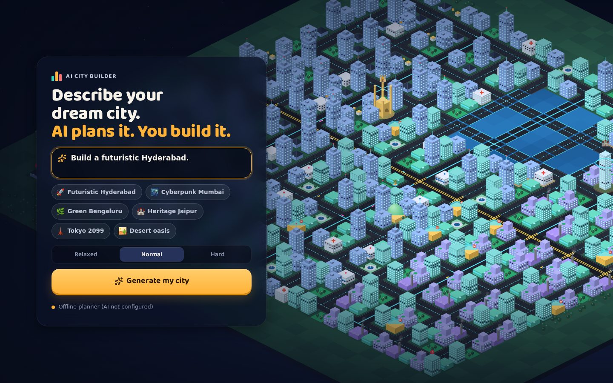
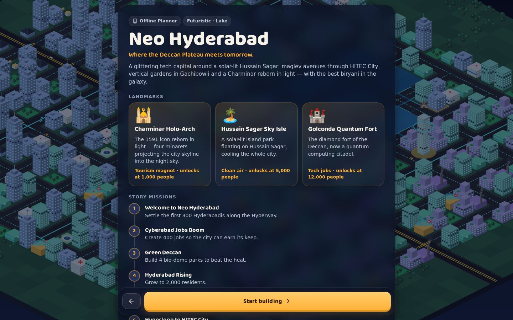
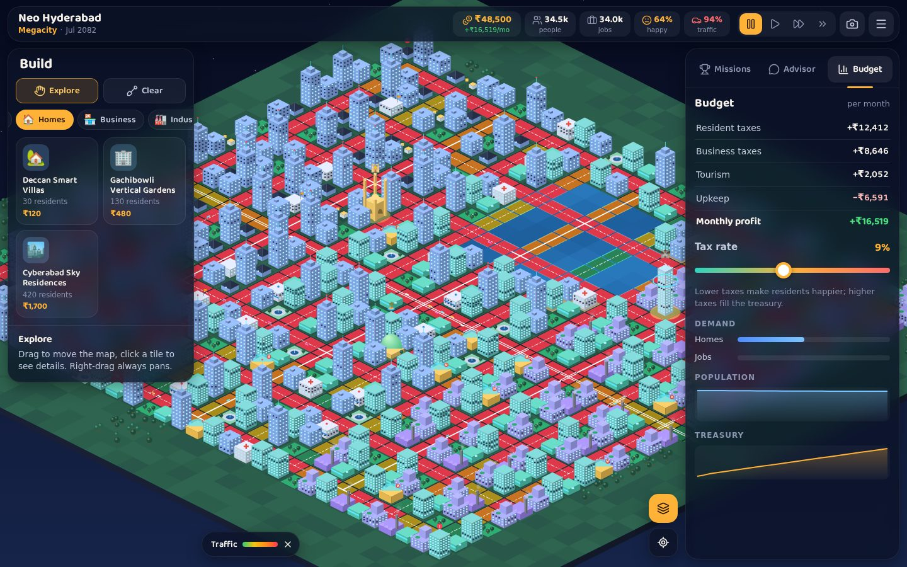
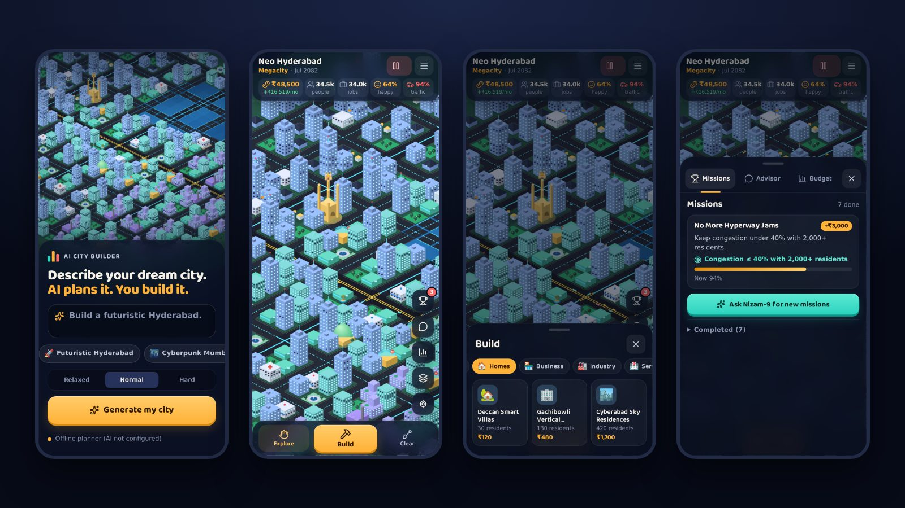
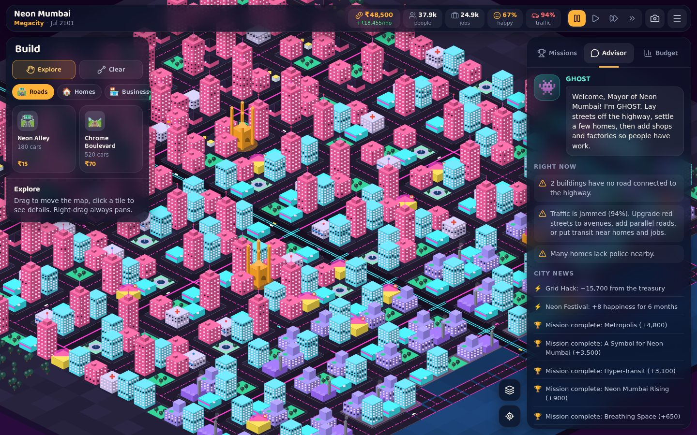

# AI City Builder

**Describe your dream city. AI plans it. You build it.**

Type something like *“Build a futuristic Hyderabad.”* Claude designs the city: its name, look, terrain, every building type, three signature landmarks, a mission storyline, random events and an advisor character. Then you build it on an isometric map while managing **money, traffic and population**.



| Describe it | AI plans it | Manage traffic |
| --- | --- | --- |
|  |  |  |

**Made for phones too:** a thumb-friendly dock, bottom sheets for building and city info, one-finger panning and tap-to-build.



## Features

- **Prompt → playable city.** Claude turns any description into a structured city plan. Real places get their own flavour: “futuristic Hyderabad” gives you Hussain Sagar, a Charminar Holo-Arch, HITEC City Data Towers, Biryani Week and an advisor called Nizam-9.
- **AI missions that react to your city.** Ask the advisor for new missions any time. It reads your city's numbers and writes goals about your actual problems: jammed roads, unemployment, an empty treasury.
- **Invent buildings.** Describe any building (“a solar-powered biryani food court”) and the AI turns it into a new tool with its own name, icon and gameplay bonus.
- **A real simulation:**
  - **Traffic:** commuters are routed along your roads, a second pass sends some drivers around jams, and congestion slows businesses and upsets residents. Fix it with avenues, parallel streets, bus stops and metro stations.
  - **Population:** grows when there are homes, jobs and happy residents. Parks, schools, hospitals, police, transit and fair taxes help; pollution, unemployment and traffic hurt.
  - **Money:** comes from resident and business taxes plus landmark tourism. Every building costs upkeep, and bigger cities cost more to run.
- **Seven visual styles** (futuristic, cyberpunk, green, heritage, coastal, desert, classic) with lakes, rivers or coastlines generated from the plan.
- **Plays great on phones.** A mobile-first layout with a bottom dock, swipeable sheets, one-finger panning, pinch zoom, tap-to-build with a confirm bar for roads and zones, and Undo. On desktop, side panels, drag-to-build and keyboard shortcuts.
- **Share your city.** 📸 Snapshots are captioned with your city's name, stats and prompt; on phones they open the share sheet (WhatsApp, Instagram and so on). Games autosave in the browser.
- **A living title screen.** A fully built city drifts behind the start screen and restyles itself when you pick an example (try “Cyberpunk Mumbai”).
- **Works without an API key.** A built-in offline planner (with flavour packs for 15 cities) steps in whenever Claude isn't configured or available.



## Quick start

Run it on your own computer (requires Node.js 20.12 or newer):

```bash
git clone https://github.com/venuikkada/AI-City-Builder.git
cd AI-City-Builder
npm install
cp .env.example .env        # optional: paste your ANTHROPIC_API_KEY into .env
npm start                   # then open http://localhost:3000
```

Without a key the game still runs, with the offline planner designing the cities. The start screen shows which planner is active. With a key, `npm run check:ai` confirms Claude works by making two real API calls (about $0.10).

## How to play

1. Describe a city (or pick an example), choose a difficulty and press **Generate my city**.
2. Review the AI's plan (landmarks, missions, building names) and press **Start building**.
3. Build **streets** off the highway. Buildings only work when a road connects them to the highway (parks excepted).
4. Place **homes**, then **shops and factories** so residents have jobs. Keep factories away from homes.
5. Watch the stats bar: money, population, jobs, happiness and traffic. Tap happiness or traffic to see that map layer; the layers button adds pollution, services and transit.
6. Complete missions for rewards. New buildings, avenues and landmarks unlock as you grow.

| Action | Mouse / keyboard | Touch |
| --- | --- | --- |
| Pan | Drag with Explore, right-drag, WASD / arrows | One finger |
| Zoom | Mouse wheel, `+` / `-` | Pinch |
| Build | Click, or drag (roads draw lines; homes, shops and parks fill areas) | Tap to place. Roads and zones: tap the start, tap the end, then **Build** |
| Undo the last build | `Ctrl`/`⌘` + `Z`, or **Undo** in the message | **Undo** in the message (same month only) |
| Pause / speed | `Space`, `0`–`3`, speed buttons | Speed button in the top bar |
| Cancel tool | `Esc` | ✕ in the bottom bar |

## How the AI works

The browser never talks to Claude directly. The Node server holds the API key and exposes three endpoints:

| Endpoint | What Claude produces | Effort |
| --- | --- | --- |
| `POST /api/plan` | Full city plan from the player's description | `medium` |
| `POST /api/missions` | Three new missions and advice, based on a snapshot of the city's stats | `low` |
| `POST /api/building` | An invented building (archetype, bonus, name, icon) | `low` |

- Uses the official `@anthropic-ai/sdk` with **structured outputs** (`output_config.format` with a JSON schema generated from zod). Enums such as building types and mission objectives are enforced by the API itself.
- Every response then passes through shared **sanitizers** (`public/js/shared/plan.js`). They clamp numbers into balanced ranges, strip markup, validate emoji and fill gaps, so AI creativity can't break game balance. All AI text is rendered as text, never HTML.
- **Server-side refusal fallback** (`fallbacks: "default"`) is enabled. If the model declines a request, Anthropic retries it on its recommended fallback model. If that also fails, or the API is unreachable, the server answers with the offline planner and a notice.
- **Cost controls:** a per-player limit (default 40 AI calls per 15 minutes) and a whole-server daily cap (default 2,000 calls). Once a limit is reached, the offline planner takes over automatically. Each call's token usage is logged.
- The default model is `claude-opus-5-5`. Change it with `ANTHROPIC_MODEL`.

## Configuration

| Variable | Default | Purpose |
| --- | --- | --- |
| `ANTHROPIC_API_KEY` | — | Enables Claude. Without it the offline planner is used. |
| `ANTHROPIC_MODEL` | `claude-opus-5-5` | Model for all AI calls. |
| `AI_EFFORT` | per endpoint | Override effort (`low`…`max`) for every call. |
| `AI_ENABLED` | auto | `0` forces offline mode; `1` forces AI (e.g. with `ant auth login` profiles). |
| `AI_FALLBACKS` | on | `off` disables server-side refusal fallbacks. |
| `AI_MAX_REQUESTS_PER_IP` | `40` | AI calls per player per 15 minutes. |
| `AI_MAX_REQUESTS_PER_DAY` | `2000` | Daily cap across all players. |
| `PORT` | `3000` | HTTP port. |
| `TRUST_PROXY` | off | Set to `1` behind a reverse proxy so rate limits use `X-Forwarded-For`. |

## Deploying

Any Node.js host works: Render, Railway, Fly.io, Hostinger Node.js hosting, or a VPS.

1. **Build and start:** `npm ci --omit=dev`, then `npm start` (runs `server.js`). Use Node 20.12 or newer.
2. **Environment:** set `ANTHROPIC_API_KEY` as a secret. Set `TRUST_PROXY=1` on platforms that put a proxy in front of your app (most do); otherwise every player shares one AI rate limit. The server logs a warning when it detects this.
3. **Health check:** `GET /api/status` returns `{"ai": true|false, …}`.
4. **Verify the key:** run `npm run check:ai` once with the production key.
5. **Request timeouts:** an AI city plan can take up to a minute or two. If your host cuts requests off sooner, players get the offline planner instead. Pick a host that allows long requests, or set `AI_EFFORT=low`.

For **static hosting only** (GitHub Pages, Netlify, itch.io), upload the `public/` folder. The game detects that there's no server and uses the in-browser offline planner, including on hosts that rewrite unknown routes to `index.html`.

The page is iframe-friendly, so it can be embedded on web-game portals.

## Project structure

```
server.js               Entry point: loads .env and starts the server
public/                 Browser game (plain ES modules, no build step)
  js/shared/            Code shared with the server: building catalog, plan sanitizers, offline planner
  js/game/              Simulation: map & terrain, placement, traffic routing, economy, missions, advisor tips
  js/render.js          Isometric canvas renderer (procedural buildings, cars, overlays)
  js/main.js, ui.js     Screens, game loop, HUD, build menu, sheets and panels
  js/input.js           Mouse, touch and keyboard controls
  js/demo.js            The living city behind the start screen
  js/icons.js           UI icons (Lucide)
  fonts/                Baloo 2 display font (self-hosted)
server/                 Node HTTP server, Claude integration, prompts and schemas
scripts/check-ai.js     `npm run check:ai`: verifies your Claude key and model
test/                   node:test suites (simulation, traffic, sanitizers, AI client, server)
docs/                   Screenshots and the go-to-market playbook
```

## Development

```bash
npm test     # 43 tests: simulation balance, traffic routing, undo, sanitizers, AI client (mocked), HTTP server
npm run dev  # restart the server on file changes
npm run check:ai  # real Claude calls with your key
```

Open `http://localhost:3000/?debug` to expose `window.aicb` (app state, renderer, analysis) in the browser console.

## Selling it

See **[docs/MARKETING.md](docs/MARKETING.md)** for the go-to-market playbook: positioning, pricing, launch plan, content hooks and B2B/education sales.

## Credits

- [Baloo 2](https://github.com/EkType/Baloo2) by Ek Type, SIL Open Font License 1.1 (`public/fonts/OFL-Baloo2.txt`).
- Interface icons from [Lucide](https://lucide.dev), ISC License; some derive from Feather, MIT License (`public/js/LICENSE-lucide.txt`).
